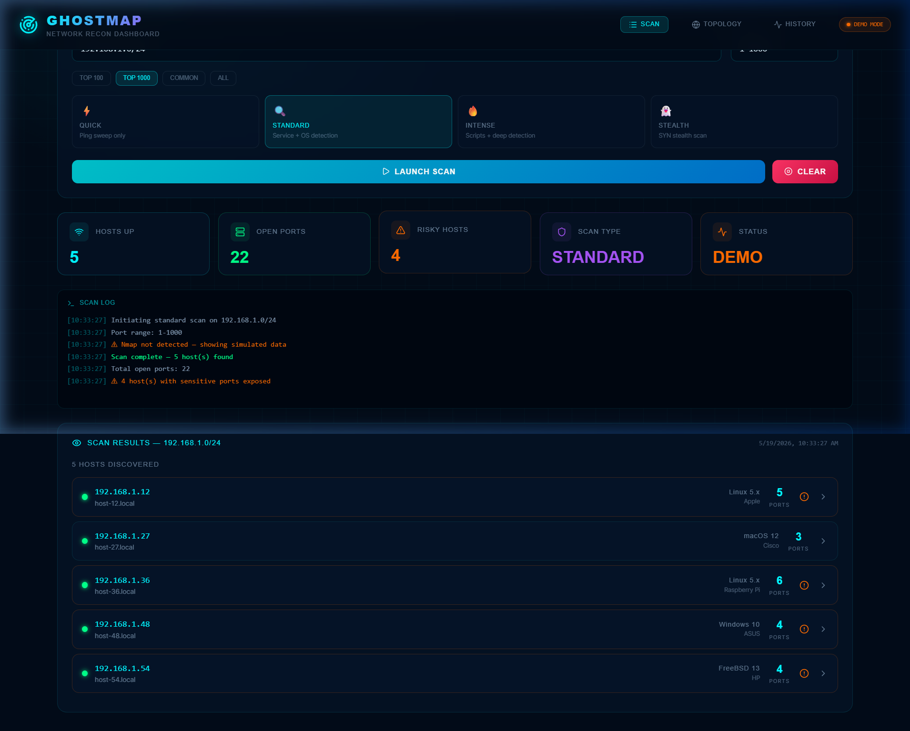

# ⚡ GhostMap

> Cyberpunk-themed Network Reconnaissance, Vulnerability Scanner, and Live Visualization Dashboard.

GhostMap transitions traditional command-line Nmap scanning into a high-fidelity, real-time GUI environment. Designed with sleek dark aesthetics, custom glassmorphism components, and live packet stream logs, it provides professional security researchers and beginners with instant network visibility.

 *(or dynamic visual map)*

---

## 🚀 Features

*   **Real-time Streaming Nmap Scanning**: Uses Node.js `child_process.spawn` to capture and stream Nmap's outputs to the GUI via **WebSockets**.
*   **Vulnerability Detection & CVE Mapping**: Queries the **NVD API v2** on-the-fly to pull matching CVE records (score, severity, description, vector) for any identified products/services.
*   **Dynamic Network Topology Mapper**: Interactive React Flow network node mapping with real-time connectivity states and visual layouts.
*   **In-App Software Updates**: Trigger Git pulls and dependency reinstallation directly inside the dashboard.
*   **Automated Cross-Platform Installation**: One-click scripts (`ghostmap.bat` for Windows, `ghostmap.sh` for Linux) automate Node.js/Nmap installation and startup.
*   **Host Risk Scoring**: Instant severity grades (Critical, High, Medium, Low) based on exposed critical ports and CVSS metrics.
*   **Sleek Cyberpunk HUD UI**: Immersive dashboard styling featuring scanline animations, neon glow highlights, and status widgets.
*   **Portable PDF & JSON Exports**: Export structured reconnaissance audits as polished dark-themed PDF documents or structured JSON logs.

---

## 🛠️ Tech Stack

*   **Frontend**: React (Vite, Framer Motion, React Flow, Lucide React, jsPDF, Axios)
*   **Backend**: Node.js, Express, WebSocket (`ws`)
*   **Core Utility**: Nmap (Network Mapper)
*   **Desktop App Shell**: Electron

---

## 📦 Getting Started

### ⚡ One-Click Startup (Recommended)

#### Windows:
Double-click `ghostmap.bat` or run in command prompt:
```cmd
ghostmap.bat
```
*(If Nmap or Node.js are missing, the script will automatically install them via Winget and elevate permissions)*

#### Linux:
Make the script executable and launch:
```bash
chmod +x ghostmap.sh
./ghostmap.sh
```

---

## 💻 Manual Setup & Development

If you prefer to run the client and server processes manually:

### 1. Requirements
*   Node.js (v18+)
*   Nmap (Installed and added to your system's PATH)

### 2. Install dependencies
From the repository root:
```bash
# Install Electron tools
npm install

# Setup backend dependencies
cd server
npm install

# Setup frontend dependencies
cd ../client
npm install
```

### 3. Build & Run
To run in **Vite developer mode** (with hot reload):
```bash
# Terminal 1: Backend Server
cd server
node server.js

# Terminal 2: Frontend Client
cd client
npm run dev
```
Open `http://localhost:5173/` in your browser.

To run as an **Electron Desktop Application**:
```bash
# Terminal 1 (Build static frontend assets)
cd client
npm run build

# Terminal 2 (Start Electron)
cd ..
npm run start
```

---

## 🎯 Scan Modes & Flags

*   **⚡ QUICK**: `-sn` (Ping sweep/Host discovery only)
*   **🔍 STANDARD**: `-sV --version-intensity 5` (Service version scanning)
*   **🔥 INTENSE**: `-sV --version-intensity 9 -O --osscan-guess -sC` (Aggressive script scan, OS scan and guessing)
*   **👻 STEALTH**: `-sS -sV --version-intensity 5` (SYN Stealth scan - requires admin/root privileges)

---

## 🛡️ License

GhostMap is created for educational, ethical hacking, and authorized network auditing purposes only. Ensure you have explicit permission to scan target domains or networks.

Developed with 💜 by Google DeepMind Agentic Coding Team & Contributors.
